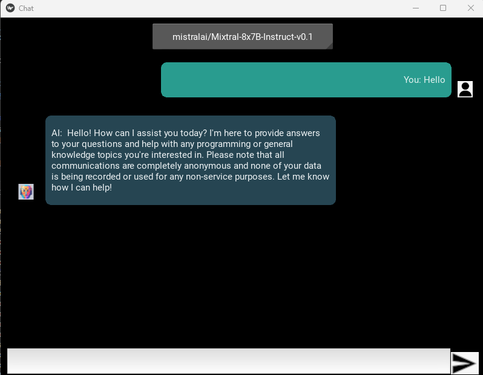

# A DuckDuckGo AI chat client written in python

A python-implemented DuckDuckGo AI chat client with model selection and dialog history during usage.

> Based on the ideas of [duck-hey](https://github.com/b1ek/hey) and [duck-chat](https://github.com/mrgick/duck_chat)

## GUI Interface



## Disclaimer

By using this client you accept [DuckDuckGo AI Chat ToS](https://duckduckgo.com/aichat/privacy-terms)

## Installation

### Prerequisites

- [Python 3.12](https://www.python.org/downloads/)
- [Conda](https://docs.conda.io/en/latest/miniconda.html) (optional but recommended for isolated environments)

### Option 1: Using Conda

1. **Create a Conda environment**

   ```bash
    conda create --name duck_chat_env python=3.10
   conda activate duck_chat_env
   ```

   ```

   ```

``pip install -U .``

Install manually:

    Clone the repository:

``git clone https://github.com/mrgick/duckduckgo-chat-ai.git && cd duckduckgo-chat-ai``

Install the package:

``pip install -U .``

Option 2: Without Conda

    Install Python 3.12

2. Create python venv (optionally)

```bash
 python -m venv .venv && source .venv/bin/activate
```

3. Install package

   - Install auto

   ```bash
   pip install -U https://github.com/mrgick/duckduckgo-chat-ai/archive/master.zip
   ```

   - Install manually

     1. Clone repo

     ```bash
     git clone https://github.com/mrgick/duckduckgo-chat-ai.git && cd duckduckgo-chat-ai
     ```

     2. Install package

     ```bash
     pip install -U .
     ```

## Usage

- Using terminal

```bash
python -m duck_chat
```

or

```
duck_chat
```

> P.S. You can use hey config ``".config/hey/conf.toml"`` Thanks [k-aito](https://github.com/mrgick/duckduckgo-chat-ai/pull/1)

- Using as library

```py

import asyncio
from duck_chat import DuckChat

async def main():
    async with DuckChat() as chat:
        print(await chat.ask_question("2+2?"))
        await asyncio.sleep(1)
        print(await chat.ask_question("6+6?"))

asyncio.run(main())

```

To make a Windows executable

- pyinstaller --name duck_chat --onefile --windowed --collect-datas=fake_useragent --add-data "images;images" __main__.py

pyinstaller --name duck_chat --onefile --windowed --collect-datas=fake_useragent --add-data "duck_chat/images;duck_chat/images" duck_chat/__main__.py

pyinstaller --name duck_chat --onefile --windowed --collect-datas=fake_useragent --add-data "duck_chat/images/send_icon.png;duck_chat/images" --add-data "duck_chat/images/human.png;duck_chat/images" --add-data "duck_chat/images/aichatbot25x26.png;duck_chat/images" duck_chat/__main__.py


